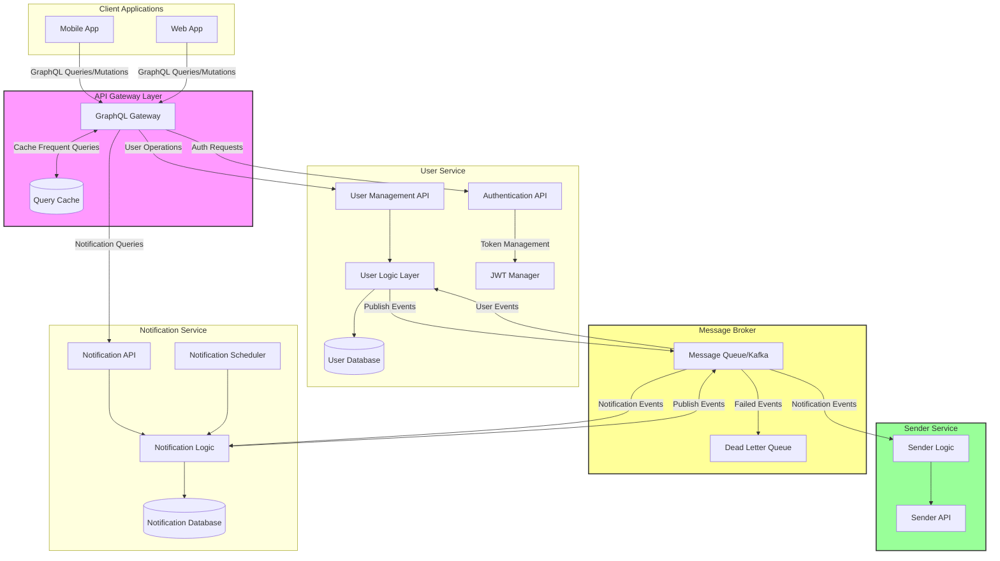

# Scalable Notification System

A *Scalable Notification System* designed using microservices architecture to efficiently manage and deliver notifications to users. This system leverages a GraphQL gateway to orchestrate interactions between different services, ensuring scalability, reliability, and maintainability.

## Table of Contents

- [Architecture](#architecture)
- [Services](#services)
- [Technologies Used](#technologies-used)
- [Installation](#installation)
- [Usage](#usage)
- [Sample Queries and Mutations](#sample-queries-and-mutations)
- [Contributing](#contributing)
- [License](#license)
- [Contact](#contact)

## Architecture

The *Scalable Notification System* follows a microservices architecture, comprising distinct services that handle specific responsibilities. This separation of concerns ensures that each service can be developed, deployed, and scaled independently.

# System Architecture

The following diagram illustrates the overall system architecture:



## Services

- *GraphQL Gateway*: Central hub for client interactions, aggregating data from various microservices.
- *User Service*: Manages user-related operations, including registration, authentication, and user preferences.
- *Notification Service*: Handles the creation, retrieval, and management of user notifications.
- *Message Service*: (Planned) Will manage messaging functionalities between users.

## Technologies Used

- *Node.js*: JavaScript runtime for building server-side applications.
- *Express.js*: Web framework for Node.js.
- *GraphQL*: Query language for APIs.
- *Apollo Server*: GraphQL server implementation.
- *MongoDB*: NoSQL database for data persistence.
- *Kafka & Zookeeper*: For event streaming and message brokering.
- *Docker & Docker Compose*: Containerization and orchestration.

## Installation

Follow these steps to set up the project locally:

1. *Clone the Repository:*

   bash
   git clone https://github.com/your-username/scalable-notification-system.git
   

2. *Navigate to the Project Directory:*

   bash
   cd scalable-notification-system
   

3. *Set Up Environment Variables:*

   Create a .env file in each service directory with the necessary environment variables.

4. *Start Services with Docker Compose:*

   Ensure that Docker and Docker Compose are installed on your machine.

   bash
   docker-compose up --build
   

5. *Access the Application:*

   - *GraphQL Gateway*: http://localhost:4000
   - *User Service*: http://localhost:3001
   - *Notification Service*: http://localhost:3002

## Usage

Interact with the *Scalable Notification System* through the GraphQL Gateway. You can use tools like [Apollo Studio](https://studio.apollographql.com/) or [GraphQL Playground](https://github.com/graphql/graphql-playground) to send queries and mutations.

## Sample Queries and Mutations
### Register User
```
graphql
    mutation {
        registerUser(name: "Alice Johnson", email: "alice.johnson@example.com", password: "securepassword") {
            id
            name
            email
        }
    }
```
### Login
```
graphql
mutation {
    login(email: "alice.johnson@example.com", password: "securepassword") {
        token
    }
}
```


### updateUser
```
graphql
mutation {
    updateUserPreferences(id: "user_id_here", preferences: ["promotion", "order_updates"]) {
        id
        preferences
    }
}
```
### getNotifications
```
graphql
    query {
        getNotifications(userId "user_id_here") {
            id
            message
            read
        }
    }
```

### Mark notification as Read 
graphql
```
mutation {
            markNotificationAsRead(id:     "notification_id_here") {
        id
        read    
    }
}
```


---
